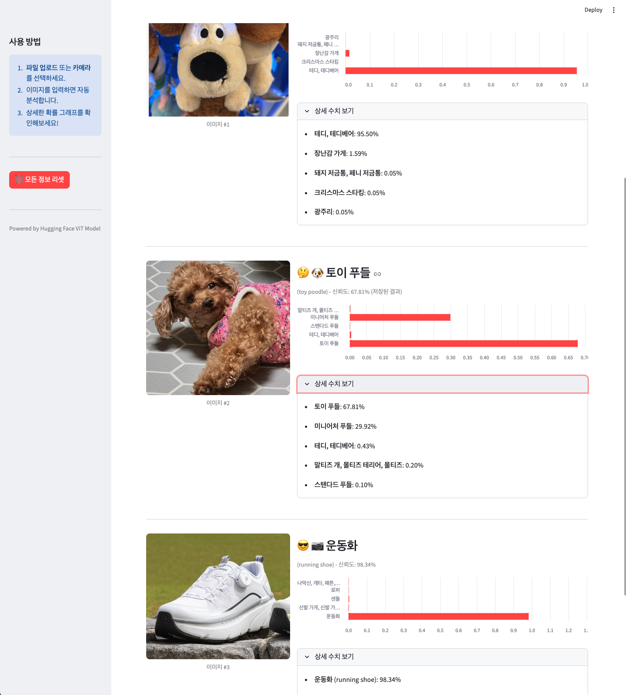
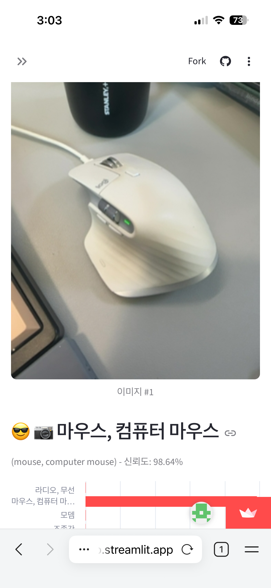

# 🖼️ AI 이미지 분류 서비스 (Streamlit App)

사용자가 업로드한 이미지를 분석하여 어떤 사물이나 동물인지 알려주는 **Streamlit 기반 인공지능 웹 서비스**입니다.

> **👉 서비스 바로가기:** [https://part4-mission17-sb.streamlit.app/](https://part4-mission17-sb.streamlit.app/)

---

## 📅 프로젝트 개요

- **미션**: Streamlit을 활용해 Hugging Face의 분류 모델을 연동하고, 웹으로 배포하여 누구나 사용할 수 있는 AI 서비스를 구현합니다.
- **주요 기능**:
  - 📁 **이미지 업로드**: JPG, PNG 등 이미지 파일을 업로드하여 분석
  - 📸 **카메라 촬영**: 웹캠/모바일 카메라로 즉석 촬영 후 분석
  - 📊 **시각화**: Top-5 예측 결과를 막대 차트로 한눈에 확인
  - 🇰🇷 **한글 결과**: 영어로 된 분석 결과를 자동으로 한국어로 번역하여 제공
  - 🐶 **귀여운 UI**: 분석 결과에 따라 맞춤 이모지 표시 및 깔끔한 디자인 적용

---

## 🖥️ 실행 화면

|          PC 화면           |            모바일 화면            |
| :------------------------: | :-------------------------------: |
|     |  |
| _PC 웹 브라우저 실행 모습_ |      _모바일 환경 실행 모습_      |

---

## 🛠️ 기술 스택 및 사용 모델

이 서비스는 **Streamlit** 프레임워크 위에서 동작하며, 다음과 같은 AI 모델과 라이브러리를 사용합니다.

### 1. 이미지 분류 (Image Classification)

- **Model**: `google/vit-base-patch16-224`
- **설명**: Google의 Vision Transformer(ViT) 모델로, 이미지를 16x16 패치로 나누어 분석합니다. ImageNet 데이터로 학습되어 1,000가지의 사물과 동물을 인식할 수 있습니다.

### 2. 한글 번역 (Translation)

- **Library**: `deep-translator` (Google Translate API)
- **설명**: 분류 모델의 결과(영어)를 한국어로 변환하기 위해 사용합니다. 가볍고 정확도가 높습니다.

---

## 📝 개발 과정 및 트러블슈팅 (Troubleshooting)

프로젝트를 진행하며 겪었던 주요 이슈와 해결 과정을 기록합니다.

### Issue 1. Hugging Face 번역 모델의 접근 권한 에러

- **문제**: 처음에는 `Helsinki-NLP/opus-mt-en-ko` 모델을 사용하려 했으나, `401 Unauthorized` 에러가 발생하며 접근이 불가능했습니다. (일시적인 허브 오류 추정)
- **시도**: `google-t5/t5-base` 모델로 교체하여 진행했습니다.

### Issue 2. 번역 품질 문제 (Toy Poodle ➡️ 장난감 푸들?)

- **문제**: T5 모델을 사용했더니 "Toy Poodle"을 **"장난감 푸들"**로 직역하거나, 독일어(**Spielzeugpudel**)로 번역하는 등 품질과 언어 설정에 문제가 있었습니다. 이는 T5 모델이 다국어 모델이라 한국어 문맥에 최적화되지 않았기 때문입니다.
- **해결**: 복잡한 AI 모델을 로컬에 다운로드하는 대신, **`deep-translator` 라이브러리**를 도입했습니다.
  - **결과**: "Toy Poodle"을 **"토이 푸들"**로 정확하고 자연스럽게 번역하게 되었습니다.
  - **이점**: 모델 로딩 시간이 사라져 앱 속도가 비약적으로 빨라졌습니다. ⚡

### Issue 3. 중복 분석 문제

- **문제**: 여러 장의 사진을 차례로 올릴 때마다 기존 사진까지 처음부터 다시 분석하여 시간이 오래 걸렸습니다.
- **해결**: Streamlit의 `session_state`를 활용해 **캐싱(Caching) 시스템**을 구현했습니다. 한 번 분석한 이미지는 결과를 저장해두고, 새로운 이미지만 분석하도록 최적화했습니다.

### Issue 4. 차트 색상 오류

- **문제**: `StreamlitColorLengthError` 발생. 차트 데이터에 원본 라벨 텍스트가 포함되어 있어, 숫자 데이터와 매칭되지 않는 오류였습니다.
- **해결**: `st.bar_chart`에 데이터프레임을 넘길 때, 숫자 컬럼(`Confidence`)만 명시적으로 선택하여 해결했습니다.

---

## 📂 리포지토리 링크

소스 코드 및 상세 구현 내용은 아래 Github 저장소에서 확인하실 수 있습니다.
👉 **Github**: [https://github.com/jayden-code-ai/Part4_mission17](https://github.com/jayden-code-ai/Part4_mission17)

---

Copyright © 2026 Jayden. All rights reserved.
